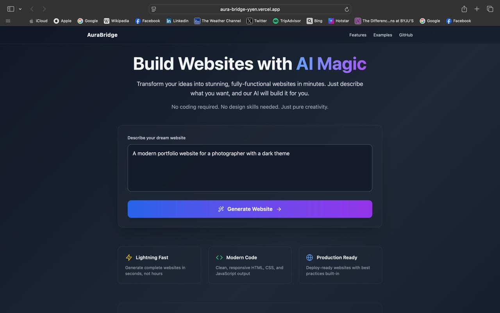

# AuraBridge

_Bridging Ideas to Web Applications, Instantly._

🔗 [https://aura-bridge-yyen.vercel.app](https://aura-bridge-yyen.vercel.app/)

### Homepage UI

### Builder Interface

AuraBridge is an ambitious project aimed at revolutionizing web development by allowing users to create and manage web applications directly within their browser. Inspired by innovative platforms like V0 and Bolt, AuraBridge seeks to replicate and enhance their core functionality, particularly Bolt's groundbreaking ability to execute code locally within a web container.

## Project Overview

The core idea behind AuraBridge is to provide a seamless and intuitive environment for users to generate web projects from simple prompts. Leveraging the power of large language models (LLMs) and advanced web technologies, AuraBridge automates much of the initial setup and coding, empowering users to rapidly bring their web ideas to life.

## Key Features & Technologies

- Intuitive Web Creation: Build complete web applications from high-level prompts.

- Gemini API Integration: Harnesses the power of Gemini models for code generation and project structuring.

- Custom Gemini Wrapper: A flexible wrapper designed to adapt Gemini capabilities for various web development use cases.

- In-Browser Code Execution (Planned): Inspired by Bolt, a key goal is to understand and implement local code execution within a web container, eliminating the need for remote servers during development.

- Prompt Engineering & Enrichment: A backend system processes and refines user prompts before sending them to the LLM, ensuring more accurate and relevant code generation.

- Structured Application Generation: The LLM provides step-by-step instructions and code snippets (e.g., initializing a React application) to construct the web project.

- Browser-Based Project Management: Users can manage, preview, and iterate on their web projects directly in the browser.

## How It Works (Conceptual Flow)

1. User Input: A user provides a high-level prompt (e.g., "Create a To-do application with a dark mode toggle").

2. Prompt Processing: The backend receives the prompt, modifies, and enriches it for optimal LLM interaction.

3. LLM Interaction: The refined prompt is sent to a large language model (LLM) via the custom Gemini wrapper.

4. Code Generation Steps: The LLM returns a series of steps and code segments required to build the application (e.g., "Initialize a React app," "Create a TodoItem component," "Add CSS for dark mode").

5. File Management & Updates: AuraBridge processes these steps, generating and updating the necessary files within the in-browser project environment.

6. Real-time Preview: Users can see the application evolve in real-time as the code is generated and integrated.

## Challenges Faced

Unwrapping and Updating Files: Efficiently managing and integrating generated code snippets into the project structure.

Parsing Gemini Responses: Currently using regular expressions (regex) for parsing LLM output, which needs significant improvement for robustness and accuracy.

## Future Goals

- Robust Gemini Response Parsing: Develop more sophisticated methods for parsing LLM outputs to ensure greater accuracy and reliability.

- Editable Code in File Viewer/Explorer: Implement an integrated code editor within the file viewer to allow direct modification of generated code.

- Streamlining Responses: Optimize data processing and rendering for smooth, fast loading of generated content and project updates.

- Integrated Shell/Terminal: Provide a command-line interface within the browser for advanced user interaction and project control.

- Exporting and Deploying: Develop robust functionalities for exporting generated code and seamless deployment to various hosting platforms.

- Add Reference Assets: Allow users to easily incorporate external files, images, or links as references within their projects.

MIT License © 2025 Vasvi Garg
